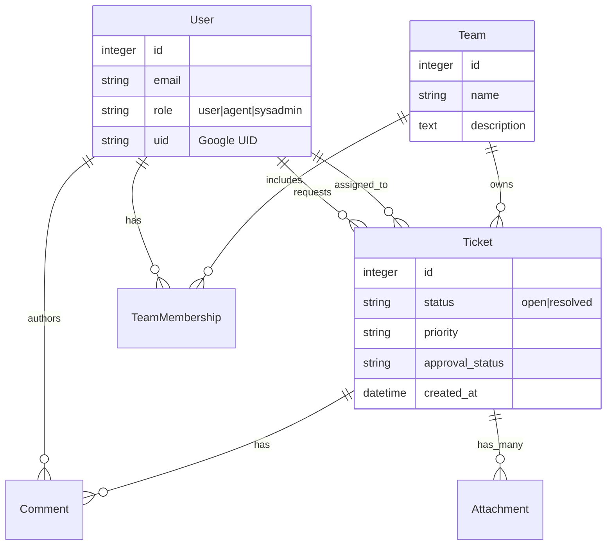
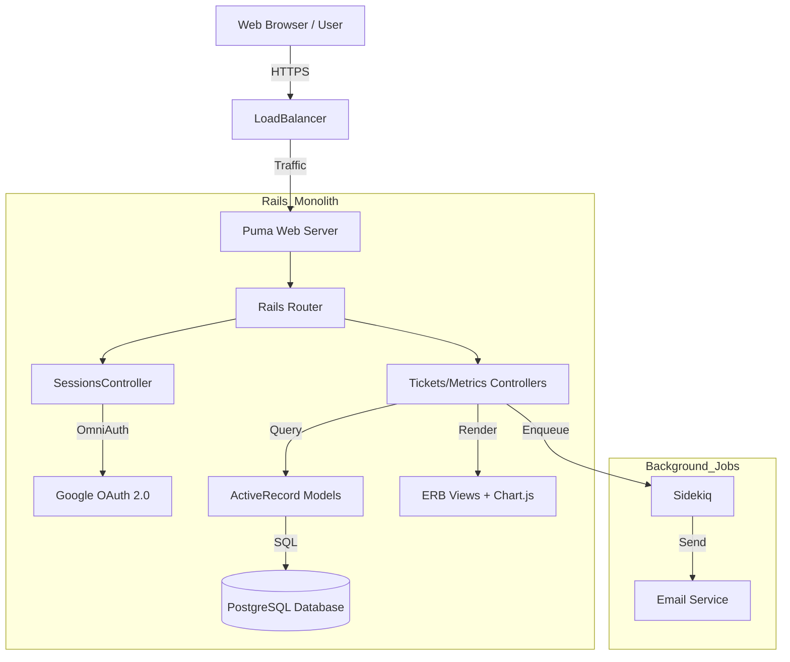
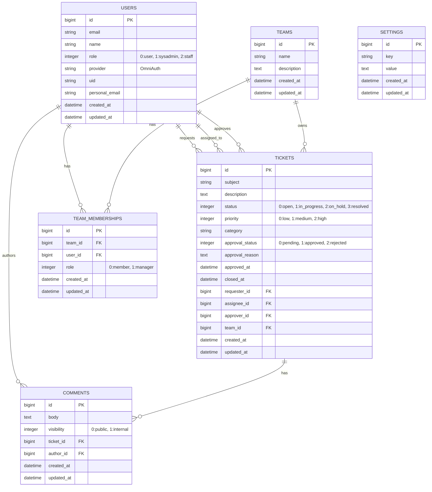
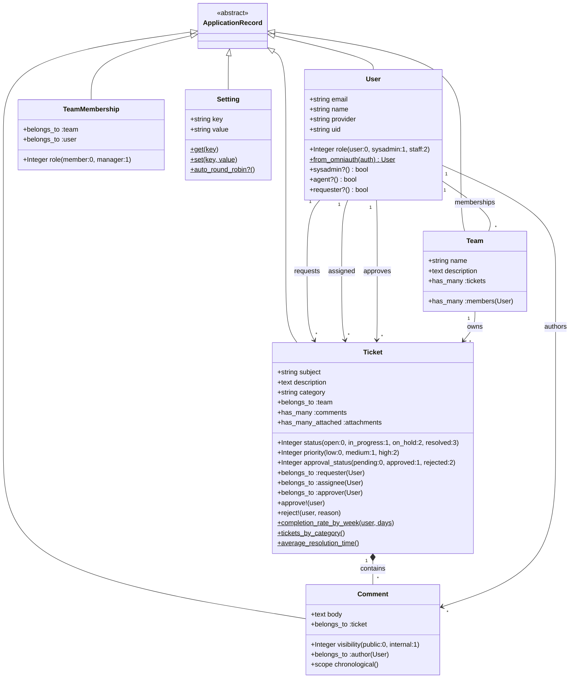

## Architecture Documentation

### 1. Class Structure

-   **User**
    
    -   `has_many :tickets` (as requester)
        
    -   `has_many :assigned_tickets` (as assignee)
        
    -   `has_many :team_memberships`
        
    -   `has_many :teams, through: :team_memberships`
        
    -   _Attributes:_ `role` (enum), `provider`, `uid`, `email`.
        
-   **Ticket**
    
    -   `belongs_to :requester (User)`
        
    -   `belongs_to :assignee (User, optional)`
        
    -   `belongs_to :team`
        
    -   `has_many :comments`
        
    -   _Attributes:_ `status`, `priority`, `approval_status`, `category`.
        
-   **Team**
    
    -   `has_many :users`
        
    -   `has_many :tickets`
        
-   **Comment**
    
    -   `belongs_to :ticket`
        
    -   `belongs_to :author (User)`
        
    -   _Attributes:_  `visibility` (public/internal).

### 2. System Diagrams

#### 2.1 Entity Relationship Diagram (ERD)

This schema reflects the associations found in the User, Team, Ticket, and Comment models.

#### 2.2 System Architecture

This diagram illustrates the request flow from the client to the database and external services.

#### 2.3 Database Diagram
- **USERS**: Stores all system users. Authentication is handled via OmniAuth (Google), storing `provider` and `uid`. The `role` column defines permissions (User, Sysadmin, Staff).

- **TICKETS**: The core entity. It links to `USERS` in three ways: `requester` (who created it), `assignee` (staff working on it), and `approver` (staff who approved/rejected it). It also belongs to a `TEAM`.

- **TEAMS**: Groups of staff members (e.g., "Support", "Ops"). Used for routing tickets.

- **TEAM_MEMBERSHIPS**: Join table for the many-to-many relationship between `USERS` and `TEAMS`.

- **COMMENTS**: Discussion threads on tickets. Includes a `visibility` flag for internal staff notes.

- **SETTINGS**: A simple key-value store for system-wide configurations (e.g., assignment strategies).

#### 2.4 Class Diagram

- **User**: Contains logic for role verification (`sysadmin?`, `agent?`) and OAuth login handling. It acts as the central actor in the system.

- **Ticket**: Contains the bulk of the business logic, including state management (enums for status, priority, approval), workflow methods (`approve!`, `reject!`), and class methods for generating dashboard metrics (e.g., `completion_rate_by_week`).

- **Team**: Represents organizational units. It has a many-to-many relationship with Users through `TeamMembership`.

- **Comment**: Simple model for communication. The `visibility` enum is critical for separating public communication from internal staff discussions.

- **Setting**: Provides a singleton-like interface (`Setting.get`, `Setting.set`) for managing dynamic system configurations without redeploying.
